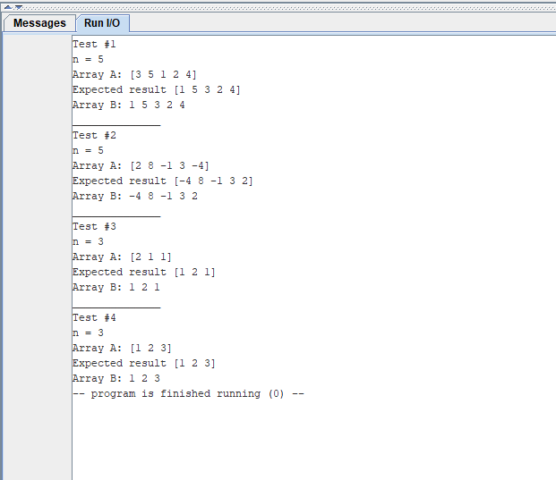

# Индивидуальное домашнее задание №1
## Евсюков Александр  <br/> Группа БПИ224  <br/> Вариант 20
## _Условие:_ 
<font size = 4>  Сформировать массив B из элементов массива A перестановкой местами минимального и первого элементов.</font>

## _Тесты:_ 
Идея программы состоит в том, что мы должны взять первый и минимальный элемент и поменять их местами. 
* Если у нас несколько минимальных элементов, то мы меняем только первый.
* Если первый элемент уже минимальный, то мы ничего не меняем.
* Программа работает с положительными, отрицательными числами и нулем.

| Ввод             	| Вывод       	|
|------------------	|-------------	|
| 5 <br>3 5 1 2 4  	| 1 5 3 2 4   	|
| 5<br>2 8 -1 3 -4 	| -4 8 -1 3 2 	|
| 3<br>2 1 1       	| 1 2 1       	|
| 3<br>1 2 3       	| 1 2 3       	|  

## _Результаты тестов:_


## _Текст программы:_
В качестве примера текста программы ниже приведен текст main, остальные подпрограммы и библиотека макросов лежат в репозитории. 
```
.include "macrolib.s"
.include "input_n.s"
.include "input_arr.s"
.include "find_min.s"
.include "create_new_array.s"
.include "output.s"

.global main

main:
.data
	.align  2				# Выравнивание на границу слова
	n:              .word	0		# Число введенных элементов массива
	array_A:        .space 64		# Массив А
	array_B:        .space 64		# Массив B
	min_number:     .word	0		# Минимальное значение
	first_number:	.word	0		# Первый элемент массива
.text
	input_n(n)					# Ввод числа элементов массива (указатель на переменную, в которую сохраним n)        

	print_str ("Input numbers: ")
	newline
	input_arr(array_A, n)				# Ввод массива (указатель на массив и число элементов)
	
	# Нахождение минимального и первого элемента (указатель на число элементов, переменную для хранения и массив)
	find_min(n, min_number, array_A)			
	lw	s1 min_number				# Кладем минимальное значение в s1		
	lw	s2 first_number				# Кладем первый элемент в s2
	print_str("min number = ")
	print_int(s1)
	print_str("\nfirst number = ")
	print_int(s2)
	
	# Создаем массив B
	create_new_array(n, array_A, array_B, min_number)
	newline
	output(array_B, n)				# Выводим массив в консоль (указатель на массив и число элементов)
	newline       		
	
	repeat						# Запрос на повторный запуск программы
	print_str("--------")				# Строка-разделитель (с \n и нулём в конце) 
	exit						# Завершение программы
```

## _Дополнительная информация:_
* Для удобства проверки в консоль также выводится информация о минимальном значении и первом элементе (`min_number` и `first_number` соответственно)
* В файле main все вызовы подпрограмм обернуты в макросы
* Все переменные хранятся в памяти, чтобы не занимать регистры 
* При выходе из подпрограммы происходит очистка всех затронутых регистров
* Для удобства реализован повторный запуск программы по желанию пользователя
* При вызове подпрограммы происходит передача необходимых переменных. Данная функция реализована с целью создания программы, которая будет способна работать с разными данными, в том числе c пользовательскими переменными
* Дополнительная тестовая программа и файлы к ней расположены в папке `test_program`
* Для корректной работы программы необходимо включить следующие настройки: 
	<br/>
